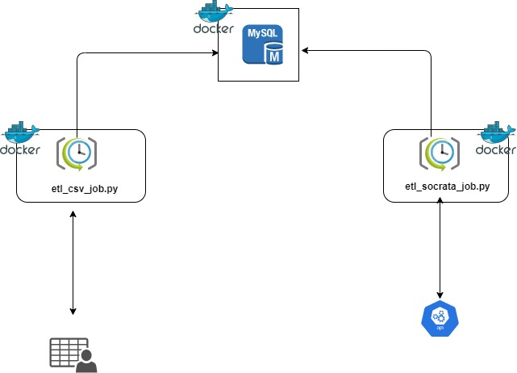

# Properly

## Requirements
Install the dependencies and devDependencies and start the server.
```sh
docker
```

### Run instructions for Properly Data Lake
```sh
docker-compose up
```

### How to check data in mysql db?
Run the properly_mysql_data.ipynb to view
the data in the db

### Current Architecture
Diagram of the current architecture




