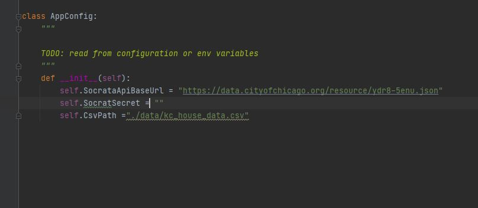
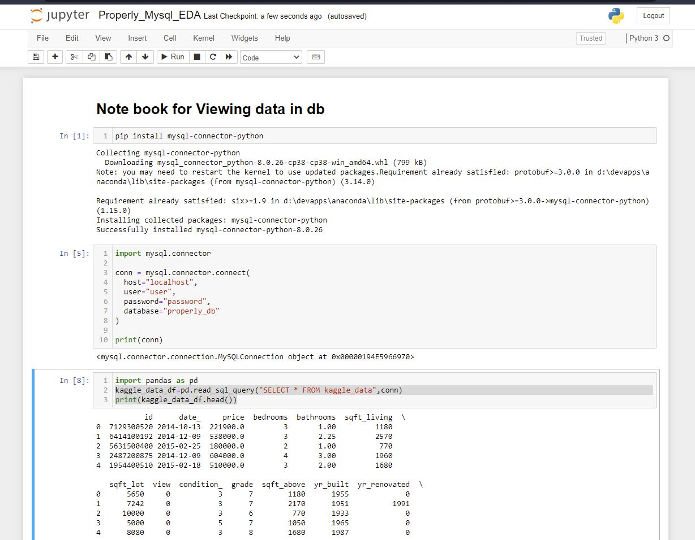

# Properly ETL

## Requirements
```sh
docker
```
## Add Socrata api key here


## Run instructions for Properly ETL
```sh
docker-compose up
```

## How to check data in mysql db?
Run the properly_mysql_data.ipynb to view
the data in the db


## Current Architecture
Diagram of the current architecture


